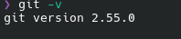
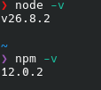
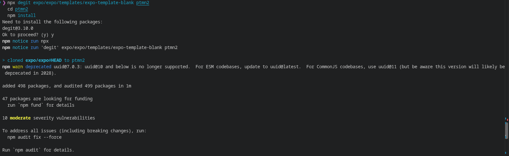

# Praktikum Menyiapkan Lingkungan Pengembangan dan Memulai Pemrograman Mobile (React Native) #

## Tujuan Pembelajaran ##
Mahasiswa Mampu :
1. Menyiapkan lingkungan penembangan dan memulai pemrogramana mobile (React Native)
2. Membuat aplikasi mobile dengan React Native
3. menyelesaikan tugas CV sederhana dengan React Native

## Materi dan Laporan Praktikum ##
1. Menyiapkan lingkungan pengembangan dan memulai pemrograman mobile (React Native)
    - Memastikan instalasi Git bash
    - cek instalalasi & versi Git bash (git -v)
    - bukti Verifikasi
        
        
    - Memastikan Node.JS dan NPM
        - Download dan Install Node.JS di https://nodejs.org/en/download/
        - Konfirmasi versi Node.JS dan NPM (node -v, npm -v)

            
2. Membuat aplikasi / Projek baru dengan rReact Native dengan Menggunakan Framework Expo go
    - Buka dan baca dokumentasi resmi link https://docs.expo.dev/get-started/create-a-project/
    - Buka dan baca dokumentasi resmi link https://reactnative.dev/docs/getting-started
    - Memulai membuat project baru
    - open terminal  change direktori ke Pertemuan-2
    - masukkan printah (npx create-expo-app ptmn2 --template blank)
    - bukti verifikasi

        
    - Running project
        - cd  ke pmtn2
        - npx expo start
        - Install Expo Go di Android atau IOS
        - bisa juga gunakan web emulator di laptop/pc
        - setelah berhentikan (ctrl + C)
        - Install (npx expo install react-dom react-native-web)
        - npx expo start --web
        - konfirmasi keberhasilan

        
4. Tugas Praktikum
    - Membuat aplikasi CV sederhana dengan React Native
    - Nama Lengkap
    - NIM
    - Asal Sekolah
    - Cita-cita
    - Rencana Untuk Menggapai Cita-cita
    - Konfimasi keberhasilan
    
        